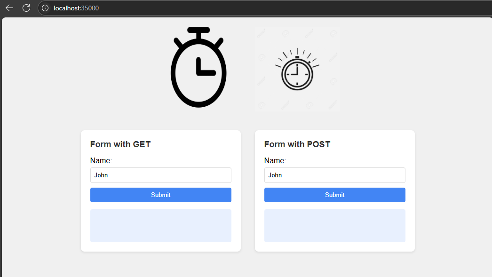
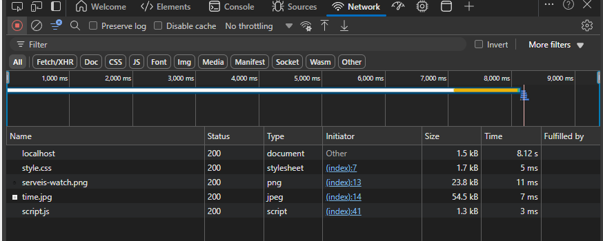
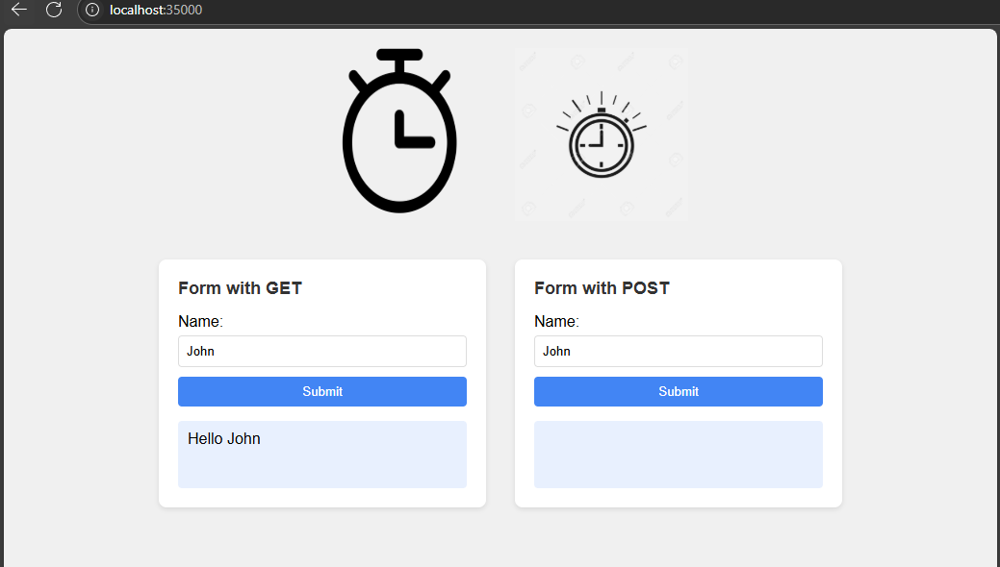
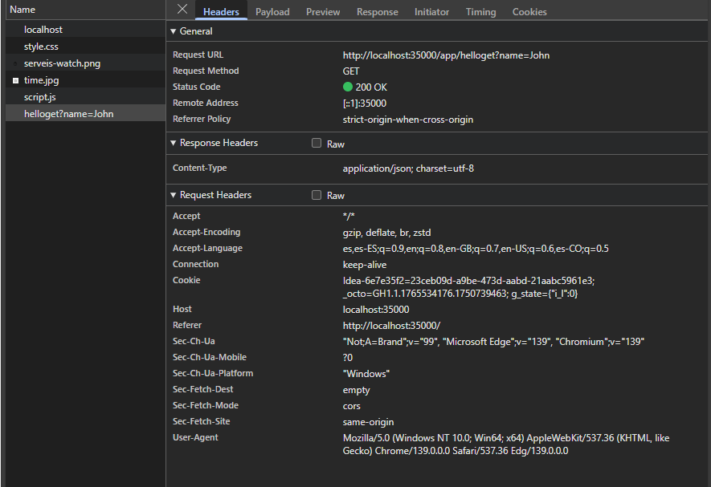
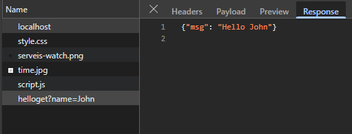
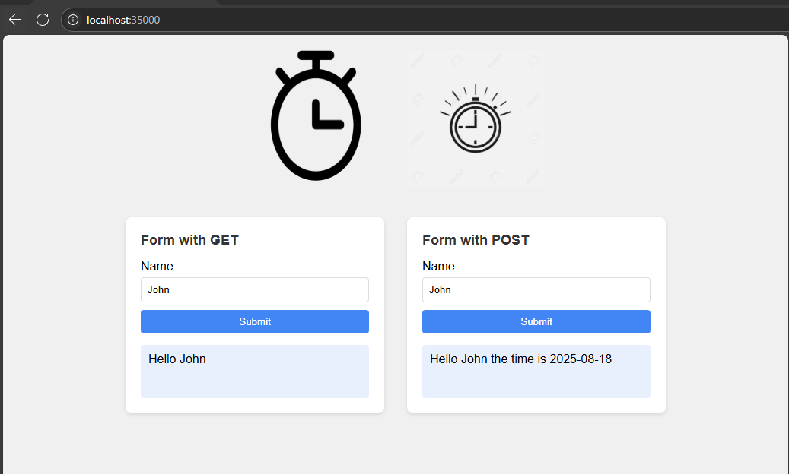
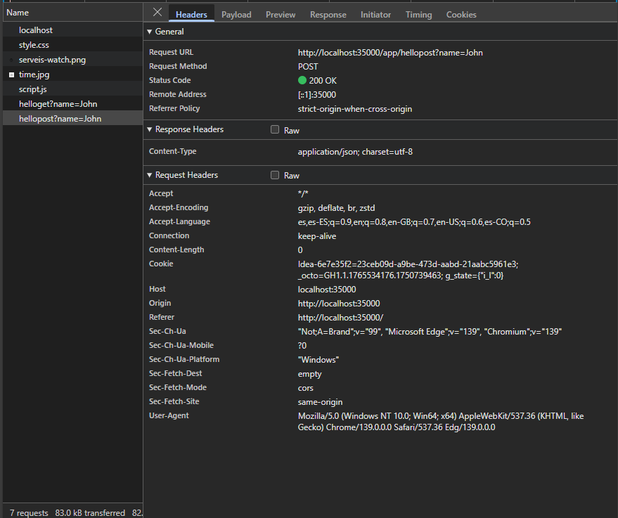
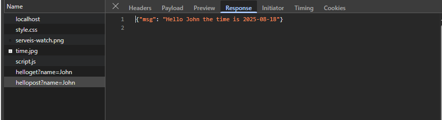

# Servidor HTTP

Este proyecto implementa un **servidor HTTP sencillo** en Java, capaz de:
- Atender peticiones GET y POST en rutas específicas (`/app/helloget` y `/app/hellopost`).
- Servir archivos estáticos desde el directorio `src/main/resources`.
- Retornar respuestas JSON.

## Requisitos

- Java 17 o superior 
- Maven 3.8+
- Git

Para instalarlos sigue los siguientes links:

[Descargar Java](https://www.oracle.com/java/technologies/javase/jdk21-archive-downloads.html)

[Instalar Maven](https://maven.apache.org/install.html)

[Instalar Git](https://git-scm.com/downloads)

Verifica la instalación con:

```bash
java --version
mvn --version
```

## Ejecución


1. Clonar el repositorio:

   ```bash
   git clone https://github.com/Daniel-Aldana10/EjercicioAREP
   cd EjercicioAREP
   ```

2. Compilar el proyecto con Maven:

   ```bash
   mvn clean package
   ```

3. Ejecutar el servidor usando el JAR:

   ```bash
   java -cp target/HttpURL-1.0-SNAPSHOT.jar com.mycompany.arep.HttpServer

   ```

4. Abrir el navegador y acceder a:
   ```
   http://localhost:35000
   ```
   O

   ```
   curl "http://localhost:35000/app/helloget?name=Daniel"
   ```
   Con la respuesta:
   ```
   {"msg": "Hello Daniel"}
   ```
   
## Prueba de uso y respuesta

Una vez corriendo la aplicacion nos dirigimos a http://localhost:35000



Luego En el panel de red del navegador se pueden encontrar las peticiones realizadas al servidor.



Luego hacemos una peticion con el formulario get 



Vemos la petición y la respuesta dada





Luego hacemos una peticion con el formulario post



Vemos la peticion y la respuesta dada





## Pruebas
Se implementaron pruebas unitarias en src/test/java/HttpServerTest.java utilizando JUnit.

### Casos de prueba cubiertos:

- /app/helloget con parámetro name → devuelve saludo.

- /app/hellopost con parámetro name → devuelve saludo con fecha.

- /app/helloget sin parámetro → retorna 400 Bad Request.

- Archivo estático existente (test.html) → retorna 200 OK con el contenido.

- Archivo estático inexistente → retorna 404 Not Found.

## Arquitectura

La arquitectura es Cliente-Servidor, que implementa un mini servidor HTTP 
y expone endpoints dinámicos y estáticos.

## Construido con
- Java
- Maven
- Junit 
## Estructura
```
EjercicioAREP/
├── src/
│   ├── main/
│   │   ├── java/com/mycompany/arep/HttpServer.java   # Servidor HTTP
│   │   └── resources/                               # Archivos estáticos 
│   └── test/
│       └── java/HttpServerTest.java                 # Pruebas unitarias
├── pom.xml                                          # Configuración Maven
└── README.md                                        # Documentación
```
## Autor

Daniel Aldana — [GitHub](https://github.com/Daniel-Aldana10)